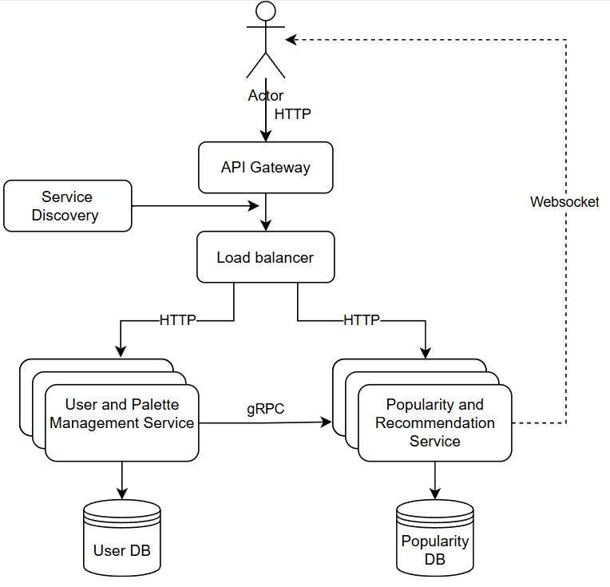

# Distributed Programming
## Color Palette App

---

## Application Suitability

### Why Microservices for a Color Palette App?
- **Separation of Concerns**: Different features (user authentication, palette management, popularity tracking) can be developed, deployed, and maintained independently.
- **Scalability**: The popularity tracking component may experience heavy traffic, so it can scale independently of user authentication.
- **Real-time Communication**: A WebSocket service for a lobby or chatroom enables users to discuss and share palettes live.

**Real-World Example**: Similar projects like Color Hunt or Coolors utilize modular and scalable systems to support user interactions, content management, and real-time updates across large user bases.

---

## Service Boundary

### Overview
The project consists of two microservices: 

1. **User and Palette Management Service**
2. **Popularity and Recommendation Service**

### Service 1: User and Palette Management Service

#### Responsibilities
- Handles user registration, authentication, and profile management.
- Manages user palettes: creating, modifying, and deleting palettes.

### Service 2: Popularity and Recommendation Service

#### Responsibilities
- Handles palette likes and tracks popular palettes.
- Fetches popular palettes based on likes or views.
- Provides palette recommendations based on trending palettes or user preferences.

---

## Technology Stack and Communication Patterns

### Service 1: User and Palette Management
- **Technology**:
  - **Programming Language**: Python (using Flask or FastAPI)
  - **Communication**: REST API for standard CRUD operations
  - **Database**: PostgreSQL (relational)

### Service 2: Popularity and Recommendation
- **Technology**:
  - **Programming Language**: JavaScript (Node.js with Express)
  - **Communication**: WebSocket for real-time notifications
  - **Database**: MongoDB (NoSQL for fast access to likes data)

### Inter-Service Communication
- Services communicate via REST APIs for synchronous operations.
- WebSockets for asynchronous real-time updates.

---

## Data Management (Database + Endpoints)

### Database Schemas

#### Users Table
| Field          | Type         | Notes                     |
|----------------|--------------|---------------------------|
| user_id        | INT, PK      | Unique user identifier    |
| username       | VARCHAR      | User's display name       |
| password_hash   | VARCHAR      | Hashed password           |
| created_at     | TIMESTAMP     | User registration time    |

#### Palettes Table
| Field          | Type         | Notes                     |
|----------------|--------------|---------------------------|
| palette_id     | INT, PK      | Unique palette identifier  |
| user_id        | INT, FK      | Foreign key to Users      |
| color_codes     | JSON         | Array of hex color codes  |
| created_at     | TIMESTAMP     | Palette creation time     |
| updated_at     | TIMESTAMP     | Palette update time       |

#### Likes Table
| Field          | Type         | Notes                     |
|----------------|--------------|---------------------------|
| like_id        | INT, PK      | Unique like identifier    |
| palette_id     | INT, FK      | Foreign key to Palettes   |
| user_id        | INT, FK      | Foreign key to Users      |
| liked_at       | TIMESTAMP     | Time when liked           |

### Endpoints

#### User and Palette Management Service
| Method | Endpoint               | Description                         | Input                        | Output                                          |
|--------|------------------------|-------------------------------------|-----------------------------|------------------------------------------------|
| POST   | `/users/register`      | Register a new user                 | `{username, password}`      | `201 Created` with user details                |
| POST   | `/palettes`            | Create a new palette                | `{user_id, color_codes}`    | `201 Created` with palette details             |
| GET    | `/palettes/:id`        | Get palette details by ID           | -                           | Palette details in JSON format                 |
| PUT    | `/palettes/:id`        | Update a palette                    | `{color_codes}`            | `200 OK` on success; `404 Not Found` if not exists |
| DELETE | `/palettes/:id`        | Delete palette by ID                | -                           | `204 No Content` on success; `404 Not Found`  |

#### Popularity and Recommendation Service
| Method | Endpoint               | Description                         | Input                        | Output                                          |
|--------|------------------------|-------------------------------------|-----------------------------|------------------------------------------------|
| GET    | `/popular`             | Fetch the most popular palettes      | -                           | List of popular palettes in JSON format       |
| POST   | `/like`                | Like a palette                      | `{palette_id, user_id}`    | `200 OK` on success; `404 Not Found` if not exists |
| **WebSocket** | `/ws/popularity` | Real-time updates for palettes      | -                           | Live updates on new palettes and popularity     |

### Data Format
All requests and responses will use **JSON** format.

---

## Deployment and Scaling

### Containerization
- Each service (User and Palette Management, Popularity Service) will be containerized using Docker for ease of deployment and management.

### Orchestration
- Use Kubernetes for managing containers and ensuring horizontal scaling based on traffic.

### Scaling Strategy
- Services will scale independently to handle high traffic in palette updates or real-time likes without affecting user authentication.
- WebSocket communication will also be scaled, with multiple WebSocket servers handling the load.

---

## WebSocket Communication

### Public Channels
- Broadcast new palettes as they are posted.
- Real-time updates for popular palettes based on the number of likes.

### Private Channels
- Users can create or join private channels for discussion around specific palettes or design topics.

---
