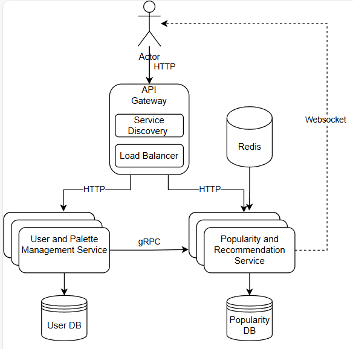

# Distributed Programming
## Color Palette App

---

## Application Suitability

### Why Microservices for a Color Palette App?
- **Separation of Concerns**: Different features (user authentication, palette management, popularity tracking) can be developed, deployed, and maintained independently.
- **Scalability**: The popularity tracking component may experience heavy traffic, so it can scale independently of user authentication.
- **Real-time Communication**: A WebSocket service for a lobby or chatroom enables users to discuss and share palettes live.

**Real-World Example**: Similar projects like Color Hunt or Coolors utilize modular and scalable systems to support user interactions, content management, and real-time updates across large user bases.

---

## Service Boundary

### Overview
The project consists of two microservices: 

1. **User and Palette Management Service**
2. **Popularity and Recommendation Service**

Each service will have its own dedicated responsibilities and database, ensuring clear boundaries between components.

### Service 1: User and Palette Management Service

#### Responsibilities
- Handles user registration, authentication, and profile management.
- Manages user palettes: creating, modifying, and deleting palettes.

#### Database
- **Users Table**: Stores user-related information (e.g., `user_id`, `username`, `password`).
- **Palettes Table**: Stores information about color palettes, including user ownership, color codes, and timestamps.

### Service 2: Popularity and Recommendation Service

#### Responsibilities
- Handles palette likes and tracks popular palettes.
- Fetches popular palettes based on likes or views.
- Fetches popular palettes filtered by categories such as "Business", "Art", or other classifications.
- Provides palette recommendations based on trending palettes or user preferences.
- Implements **WebSocket** functionality for real-time popularity updates and a dynamic **lobby mechanic**.

#### Database
- **Likes Table**: Stores palette like information (e.g., `user_id`, `palette_id`, `liked_at`).
- **Palettes Table**: Contains a `category` field to group palettes by type (e.g., Business, Art, Or other categories).

---

## Technology Stack and Communication Patterns

### Service 1: User and Palette Management
- **Technology**:
  - **Programming Language**: Python (using Flask or FastAPI)
  - **Communication**: REST API for standard CRUD operations
  - **Database**: PostgreSQL (relational)

### Service 2: Popularity and Recommendation
- **Technology**:
  - **Programming Language**: JavaScript (Node.js with Express)
  - **Communication**: WebSocket for real-time notifications and lobby functionality
  - **Database**: MongoDB (NoSQL for fast access to likes and popular palettes)

### Inter-Service Communication
- Services communicate via **REST APIs** for synchronous operations.
- **WebSockets** are used for asynchronous real-time updates.

- **Logging**: ELK Stack (Elasticsearch, Logstash, Kibana) or Prometheus + Grafana
---

## Data Management (Database + Endpoints)

### Database Schemas

#### Users Table (User and Palette Management)
| Field          | Type         | Notes                     |
|----------------|--------------|---------------------------|
| `user_id`      | INT, PK      | Unique user identifier     |
| `username`     | VARCHAR      | User's display name        |
| `password_hash`| VARCHAR      | Hashed password            |

#### Palettes Table (User and Palette Management)
| Field          | Type         | Notes                     |
|----------------|--------------|---------------------------|
| `palette_id`   | INT, PK      | Unique palette identifier  |
| `user_id`      | INT, FK      | Foreign key to Users       |
| `color_codes`  | JSON         | Array of hex color codes   |
| `category`     | VARCHAR      | Palette category (e.g., 'Business', 'Art') |
| `created_at`   | TIMESTAMP    | Palette creation time      |
| `updated_at`   | TIMESTAMP    | Palette update time        |

#### Likes Table (Popularity and Recommendation)
| Field          | Type         | Notes                     |
|----------------|--------------|---------------------------|
| `like_id`      | INT, PK      | Unique like identifier     |
| `palette_id`   | INT, FK      | Foreign key to Palettes    |
| `user_id`      | INT, FK      | Foreign key to Users       |
| `liked_at`     | TIMESTAMP    | Time when liked            |

### Endpoints

#### User and Palette Management Service
| Method | Endpoint               | Description                         | Input                        | Output                                          |
|--------|------------------------|-------------------------------------|------------------------------|------------------------------------------------|
| POST   | `/users/register`      | Register a new user                 | `{username, password}`        | `201 Created` with user details                |
| POST   | `/palettes`            | Create a new palette                | `{user_id, color_codes}`      | `201 Created` with palette details             |
| GET    | `/palettes/:id`        | Get palette details by ID           | -                            | Palette details in JSON format                 |
| PUT    | `/palettes/:id`        | Update a palette                    | `{color_codes}`               | `200 OK` on success; `404 Not Found` if not exists |
| DELETE | `/palettes/:id`        | Delete palette by ID                | -                            | `204 No Content` on success; `404 Not Found`   |

#### Popularity and Recommendation Service
| Method       | Endpoint                   | Description                           | Input                             | Output                                          |
|--------------|----------------------------|---------------------------------------|-----------------------------------|------------------------------------------------|
| GET          | `/popular`                 | Fetch the most popular palettes       | -                                 | List of popular palettes in JSON format        |
| GET          | `/popular/:category`       | Fetch popular palettes by category    | `{category}`                      | List of popular palettes within a category     |
| POST         | `/like`                    | Like a palette                        | `{palette_id, user_id}`           | `200 OK` on success; `404 Not Found` if not exists |
| **WebSocket**| `/ws/popularity`           | Real-time updates for all palettes    | -                                 | Live updates on new palettes and popularity    |
| **WebSocket**| `/ws/popularity/:category` | Real-time updates by category         | `{category}`                      | Live updates on popular palettes in a category |

### Data Format
All requests and responses will use **JSON** format.

---

## Deployment and Scaling

### Containerization
- Each service (User and Palette Management, Popularity Service) will be containerized using **Docker** for ease of deployment and management.

### Orchestration
- Use **Kubernetes** for managing containers and ensuring horizontal scaling based on traffic.

### Scaling Strategy
- Services will scale independently to handle high traffic in palette updates or real-time likes without affecting user authentication.
- **WebSocket communication** will also be scaled, with multiple WebSocket servers handling the load.

---

## WebSocket Communication (Lobby Mechanic)

### Public Channels
- Broadcast **new palettes** as they are posted.
- Provide real-time updates for **popular palettes** based on the number of likes.

### Private Channels (Lobby Mechanic)
- Users can dynamically **create or join private channels** tied to specific palettes or design topics.
- These channels act as lobbies where multiple users can connect and discuss a palette or a trend in real-time.
- **Channel Creation**: Channels can be created on-demand when users wish to discuss a palette (e.g., "Palette #123 Discussion").
- **Multiple Users**: Several users can stay connected within the same channel, and they will receive updates instantly (i.e., real-time chat functionality).
- **Multiple Dynamic Channels**: The service will allow multiple lobby channels to exist at the same time, scaling based on the number of discussions.

---

## Architecture Diagram

---

## Updated Architecture Diagram

---

### How to Run
1. **Install Dependencies**
   - Python 3.12, Node.js 20.10.0, PostgreSQL, MongoDB
2. **Docker**
   - Run `docker-compose up` to start all services.
   - Verify by accessing the `/status` endpoint.

### Endpoints Documentation
- **User and Palette Management Service**
  - `POST /users/register` - Register a new user.
  - `POST /palettes` - Create a new palette.
  - **...** (Complete list in documentation)
- **Popularity and Recommendation Service**
  - `GET /popular` - Fetch popular palettes.
  - `POST /like` - Like a palette.
  - **...**

### Testing with Postman
1. Import the collection (`color-palette-app.postman_collection.json`).
2. Use the pre-configured requests to test each endpoint.

# Project Design and Technology Justifications

## Saga vs. Transaction Coordination
In a microservices architecture, **Saga** and **Two-Phase Commit (2PC)** are two patterns used for ensuring consistency in distributed transactions. 

### Saga Pattern
The **Saga** pattern breaks down a transaction into a series of smaller, isolated actions that can be rolled back if any fail. This approach is more suitable for microservices since it allows each service to manage its own part of the transaction independently, promoting better fault tolerance and less coupling.

### Why Saga Over 2PC?
- **Reliability**: Saga supports partial rollbacks, meaning it is easier to handle failures across distributed services.
- **Scalability**: Saga avoids the locking issues common in 2PC, enabling each service to function independently and scale without tight coupling.
  
### Use Case in This Project
We’ll use the Saga pattern to handle operations that span multiple services, such as when a new palette is created and must be saved across several databases. If a failure occurs, the system can rollback or compensate, ensuring data consistency across services without central locking.

---

## Consistent Hashing
**Consistent Hashing** is a technique used to distribute requests evenly across a cluster, especially helpful in caching and load balancing. 

### Benefits of Consistent Hashing
- **Scalability**: It allows the addition or removal of nodes with minimal impact on the system, redistributing only a fraction of the data.
- **Load Balancing**: Helps to maintain a balanced load across servers, which is essential for high-traffic applications like our real-time popularity service.

### Use Case in This Project
Consistent hashing will be implemented for caching our popular palettes to improve load distribution. This will ensure that when nodes are added or removed, only a small subset of the cache needs to be reallocated.

---

## User Database Replication (Master-Slave Setup)
Database replication using a **Master-Slave Setup** is essential for high availability and data redundancy.

### How Master-Slave Replication Works
In this setup:
- **Master** database handles all the write operations.
- **Slave** databases replicate the master’s data and respond to read requests, providing high availability and load balancing for read operations.

### Why Replication?
- **High Availability**: Ensures that read operations continue smoothly even if one replica goes down.
- **Improved Performance**: Enables high availability of user data, crucial in case of peak loads, by offloading reads to replicas.

### Use Case in This Project
This setup will handle user data for authentication and palette storage, distributing read loads across replicas while keeping user data available even in case of server failure.

---

## Staging Area and Data Warehouse
A **Data Warehouse** provides a structured way to store historical data, while a **Staging Area** allows for temporary storage of data during transformations.

### Why Use a Data Warehouse and Staging Area?
- **Centralized Data Repository**: The data warehouse allows us to analyze trends in palette popularity over time.
- **Optimized Reporting**: Prepares data for analytical queries without impacting the transactional database.
- **Data Cleansing and Transformation**: The staging area allows us to process raw data before it is moved to the warehouse.

### Use Case in This Project
We will use the staging area and data warehouse to periodically aggregate palette and user interaction data. This will enable trend analysis, insights on user preferences, and improve recommendation algorithms.

---

## The ELK Stack
The **ELK Stack** (Elasticsearch, Logstash, and Kibana) is a powerful logging and monitoring tool that aggregates and visualizes logs from all services.

### Why ELK Stack?
- **Centralized Logging**: Collects logs from each service and stores them centrally, simplifying debugging.
- **Real-Time Analytics**: Elasticsearch enables quick searches across logs, and Kibana visualizes log patterns and anomalies.
- **Troubleshooting and Monitoring**: Provides real-time alerts, helping in identifying and resolving issues before they impact users.

### Use Case in This Project
The ELK stack will aggregate logs from the User and Palette Management and Popularity Services, helping us monitor real-time application health, debug errors, and proactively address issues.

---

## Data Sharding
**Data Sharding** involves splitting a database horizontally to distribute data across multiple databases or tables, which is particularly helpful for scalability.

### Benefits of Data Sharding
- **Scalability**: Reduces the load on a single database by distributing data, thus improving performance.
- **Efficiency**: Each shard contains a subset of data, which allows faster access times and resource optimization.

### Use Case in This Project
We’ll implement sharding for the Popularity and Recommendation Service’s MongoDB database to handle large volumes of data, such as likes, views, and palette popularity, ensuring fast and efficient access even as data grows.

---

## ETL Processes
**ETL (Extract, Transform, Load)** is a process that extracts data from source systems, transforms it for analysis, and loads it into a data warehouse.

### Why Use ETL?
- **Data Transformation**: Cleans and processes data, making it ready for analytics.
- **Centralized Data Storage**: Consolidates data from various sources into a unified database, providing an overview of the system’s performance and user behavior.
  
### Use Case in This Project
ETL will run periodically to gather palette usage data from the operational databases, transform it, and load it into the data warehouse. This supports our analytics needs, helping us optimize recommendations and track trends.

---

Each of these technologies and patterns contributes to building a scalable, reliable, and high-performing system suitable for the demands of our Color Palette App.

